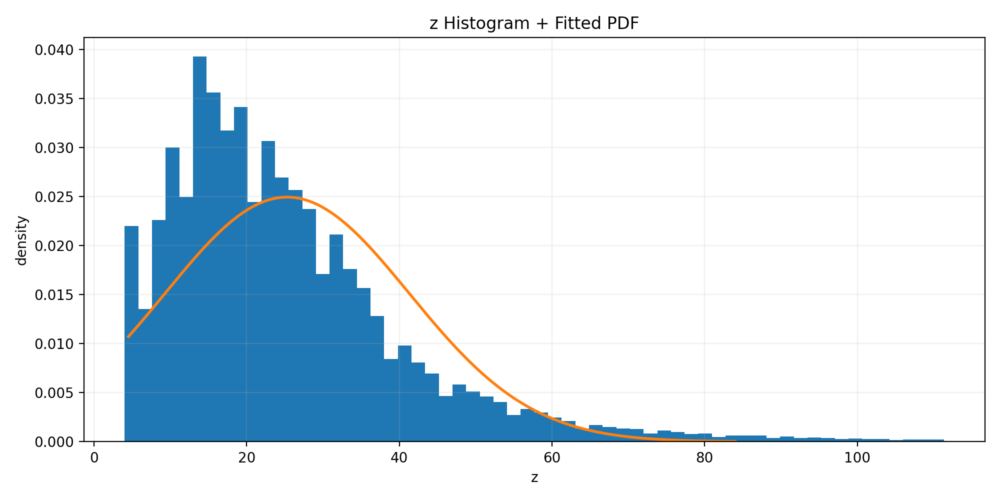

# Q: Learn Probability Density Functions using Roll-Number-Parameterized Non-Linear Model

## Objective
Given the NO2 feature `x`, we transform it into `z` using a roll-number-parameterized non-linear transform and estimate the parameters of the PDF:

$$
\hat{p}(z)=c\*e^{-\lambda(z-\mu)^2}
$$

---

## Dataset
- Dataset: India Air Quality dataset
- Feature used: **NO2** (`no2`)
- Total rows in dataset: 435742
- Valid NO2 samples used after cleaning: 415688
- Link: https://www.kaggle.com/datasets/shrutibhargava94/india-air-quality-data

---

## Methodology

### Step 1: Extract and Clean NO2
- Converted `no2` to numeric (`errors="coerce"`)
- Dropped missing values
- Removed negative values
- Trimmed extreme outliers using percentile range [0.5, 99.5] for stability

### Step 2: Transform x → z
Transformation:

$$
z = x + a_r\sin(b_r x)
$$

where

$$
a_r = 0.05(r \bmod 7), \quad b_r = 0.3((r \bmod 5)+1)
$$

For roll number **102303881**:
- $r \bmod 7 = 1 \Rightarrow a_r = 0.05$
- $r \bmod 5 = 1 \Rightarrow b_r = 0.6$

---

## Parameter Estimation (MLE)
We estimate parameters using maximum likelihood assuming a normalized Gaussian-shaped density:

$$
\hat{\mu} = \frac{1}{n}\sum_{i=1}^{n} z_i
$$

$$
\hat{\sigma}^2 = \frac{1}{n}\sum_{i=1}^{n} (z_i-\hat{\mu})^2
$$

$$
\hat{\lambda} = \frac{1}{2\hat{\sigma}^2}
$$

$$
\hat{c} = \sqrt{\frac{\hat{\lambda}}{\pi}}
$$

---

## Results

### Estimated Parameters

| Parameter | Value |
|---|---:|
| Roll Number | 102303881 |
| a_r | 0.05 |
| b_r | 0.6 |
| Estimated Mean (mu) | 25.29 |
| Estimated Lambda (lambda) | 0.00195 |
| Estimated c | 0.0249 |

A CSV of the estimated parameters is saved at: `outputs/estimated_params.csv`.

---

## Result Graph
Histogram of transformed variable `z` with fitted curve overlay:

---

## How to Run
1. Open `DS_A1_102303881_PDF_Estimation.ipynb` in Google Colab
2. Upload `data.csv` to `/content/` using Kaggle link provided
3. Run all cells
4. Final estimated values are printed in the notebook
